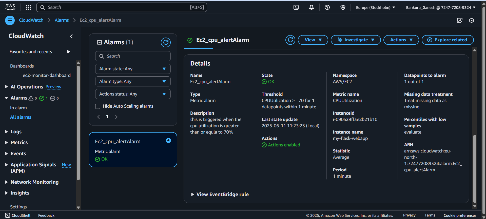

*COMPANY*: CODTECH IT SOLUTIONS

*NAME*: GANESH BANKURU

*INTERN ID*: CT06DF1421

*DOMANIN*: CLOUD COMPUTING

*DURATION*: 6 WEEKS

*MENTOR*: NEELA SANTOSH

Task 2: CLOUD-MONITORING-AND-ALERTS 

For Task 2, I worked on cloud monitoring using AWS CloudWatch, where I set up detailed monitoring for my running EC2 instance. I connected the instance to CloudWatch to track key performance metrics such as CPU utilization, Network In, and Network Out. I created a custom dashboard to visualize these metrics in real-time and set up alarms to get notified when CPU usage crossed a defined threshold. I also used the stress tool to simulate high CPU usage and verify the alarm functionality. All steps, configurations, and metric visualizations were captured with clear annotated screenshots to document the complete monitoring process effectively.

